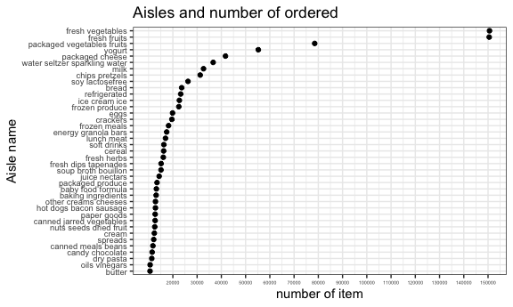
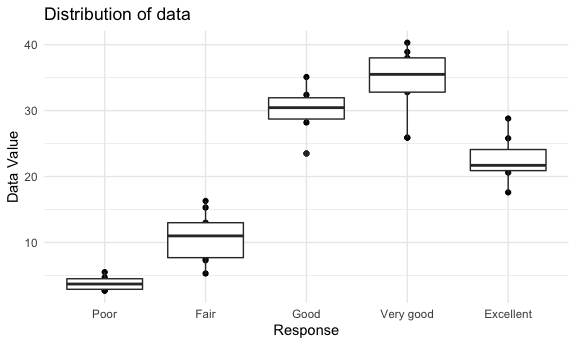
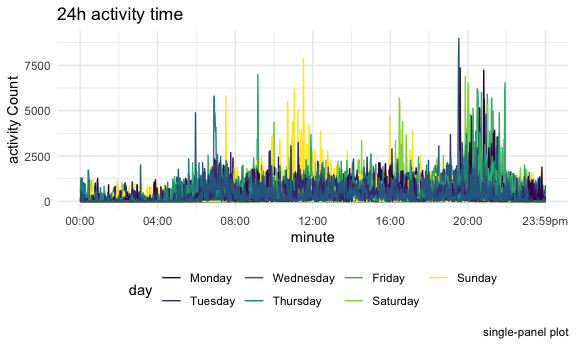

p8105\_hw3\_fs2757
================
FEI SUN
2021/10/16

# Quesiton 1

``` r
data("instacart")
ncol(instacart)
```

    ## [1] 15

``` r
nrow(instacart)
```

    ## [1] 1384617

``` r
names(instacart)
```

    ##  [1] "order_id"               "product_id"             "add_to_cart_order"     
    ##  [4] "reordered"              "user_id"                "eval_set"              
    ##  [7] "order_number"           "order_dow"              "order_hour_of_day"     
    ## [10] "days_since_prior_order" "product_name"           "aisle_id"              
    ## [13] "department_id"          "aisle"                  "department"

*in the data `instacart`, it has 15 columns and 1384617 rows. Also it
has 15 different variable and the name of all of them is order\_id,
product\_id, add\_to\_cart\_order, reordered, user\_id, eval\_set,
order\_number, order\_dow, order\_hour\_of\_day,
days\_since\_prior\_order, product\_name, aisle\_id, department\_id,
aisle, department. *

### How many aisles are there, and which aisles are the most items ordered from?

``` r
instacart %>% 
  group_by(aisle) %>% 
  summarize(asisle = n()) %>% 
  count()%>% 
  knitr::kable()
```

|   n |
|----:|
| 134 |

``` r
instacart %>% 
  group_by(aisle) %>% 
  summarize(count = n())%>% 
  arrange(desc(count))%>% 
  knitr::kable()
```

| aisle                         |  count |
|:------------------------------|-------:|
| fresh vegetables              | 150609 |
| fresh fruits                  | 150473 |
| packaged vegetables fruits    |  78493 |
| yogurt                        |  55240 |
| packaged cheese               |  41699 |
| water seltzer sparkling water |  36617 |
| milk                          |  32644 |
| chips pretzels                |  31269 |
| soy lactosefree               |  26240 |
| bread                         |  23635 |
| refrigerated                  |  23228 |
| ice cream ice                 |  22676 |
| frozen produce                |  22453 |
| eggs                          |  19875 |
| crackers                      |  19592 |
| frozen meals                  |  18221 |
| energy granola bars           |  17449 |
| lunch meat                    |  16957 |
| soft drinks                   |  16279 |
| cereal                        |  16201 |
| fresh herbs                   |  16052 |
| fresh dips tapenades          |  15142 |
| soup broth bouillon           |  15109 |
| juice nectars                 |  14350 |
| packaged produce              |  13460 |
| baby food formula             |  13198 |
| baking ingredients            |  13088 |
| other creams cheeses          |  12820 |
| hot dogs bacon sausage        |  12813 |
| paper goods                   |  12694 |
| canned jarred vegetables      |  12679 |
| nuts seeds dried fruit        |  12532 |
| cream                         |  12356 |
| spreads                       |  12102 |
| canned meals beans            |  11774 |
| candy chocolate               |  11453 |
| dry pasta                     |  11298 |
| oils vinegars                 |  10620 |
| butter                        |  10575 |
| cookies cakes                 |   9980 |
| instant foods                 |   9917 |
| breakfast bakery              |   9851 |
| condiments                    |   9743 |
| pasta sauce                   |   9736 |
| frozen breakfast              |   9729 |
| tea                           |   9376 |
| spices seasonings             |   9279 |
| frozen appetizers sides       |   8870 |
| coffee                        |   8392 |
| tortillas flat bread          |   8353 |
| missing                       |   8251 |
| frozen pizza                  |   7661 |
| asian foods                   |   7007 |
| popcorn jerky                 |   6917 |
| fruit vegetable snacks        |   6741 |
| hot cereal pancake mixes      |   6352 |
| grains rice dried goods       |   6134 |
| cleaning products             |   5894 |
| packaged poultry              |   5608 |
| poultry counter               |   5208 |
| preserved dips spreads        |   5188 |
| tofu meat alternatives        |   5123 |
| buns rolls                    |   5054 |
| pickled goods olives          |   4882 |
| doughs gelatins bake mixes    |   4758 |
| energy sports drinks          |   4742 |
| frozen vegan vegetarian       |   4727 |
| salad dressing toppings       |   4719 |
| laundry                       |   4636 |
| prepared meals                |   4133 |
| canned fruit applesauce       |   3996 |
| specialty cheeses             |   3873 |
| dish detergents               |   3870 |
| granola                       |   3803 |
| latino foods                  |   3548 |
| frozen meat seafood           |   3341 |
| canned meat seafood           |   3241 |
| meat counter                  |   3159 |
| breakfast bars pastries       |   3144 |
| oral hygiene                  |   3070 |
| prepared soups salads         |   2936 |
| food storage                  |   2906 |
| marinades meat preparation    |   2905 |
| cat food care                 |   2885 |
| honeys syrups nectars         |   2864 |
| soap                          |   2773 |
| body lotions soap             |   2137 |
| vitamins supplements          |   1969 |
| plates bowls cups flatware    |   1959 |
| beers coolers                 |   1839 |
| other                         |   1795 |
| refrigerated pudding desserts |   1729 |
| fresh pasta                   |   1628 |
| trash bags liners             |   1621 |
| dog food care                 |   1612 |
| protein meal replacements     |   1612 |
| frozen breads doughs          |   1532 |
| packaged meat                 |   1526 |
| bakery desserts               |   1501 |
| hair care                     |   1469 |
| trail mix snack mix           |   1463 |
| cold flu allergy              |   1346 |
| red wines                     |   1243 |
| digestion                     |   1205 |
| diapers wipes                 |   1109 |
| baking supplies decor         |   1094 |
| white wines                   |   1088 |
| seafood counter               |   1084 |
| air fresheners candles        |   1067 |
| cocoa drink mixes             |   1062 |
| feminine care                 |   1048 |
| spirits                       |    967 |
| mint gum                      |    962 |
| frozen dessert                |    922 |
| packaged seafood              |    909 |
| muscles joints pain relief    |    897 |
| more household                |    891 |
| deodorants                    |    858 |
| facial care                   |    746 |
| bulk dried fruits vegetables  |    725 |
| indian foods                  |    719 |
| bulk grains rice dried goods  |    634 |
| kosher foods                  |    628 |
| eye ear care                  |    548 |
| first aid                     |    539 |
| skin care                     |    534 |
| shave needs                   |    532 |
| ice cream toppings            |    504 |
| specialty wines champagnes    |    461 |
| kitchen supplies              |    448 |
| baby bath body care           |    328 |
| baby accessories              |    306 |
| frozen juice                  |    294 |
| beauty                        |    287 |

*In the data `instacart`, there are 134 aisles. Furthermore, the most
items orders form the data is `fresh vegetables`. *

### Make a plot that shows the number of items ordered in each aisle, limiting this to aisles with more than 10000 items ordered. Arrange aisles sensibly, and organize your plot so others can read it.

``` r
instacart%>% 
  group_by(aisle) %>% 
  summarize(count = n()) %>% 
  filter(count > 10000) %>% 
  ggplot() +
  geom_bar(aes(x = count, y = aisle, fill = aisle),stat = 'identity') +
  labs(title = "Aisles and number of ordered ",x = "number of item", y = "Aisle name",) +
  theme_bw() + 
  theme(legend.position = 'none',axis.text.y = element_text(size = 7))
```



### Make a table showing the three most popular items in each of the aisles “baking ingredients”, “dog food care”, and “packaged vegetables fruits”. Include the number of times each item is ordered in your table.

``` r
rbind(
  bakingingredients=instacart %>% 
  filter(aisle == "baking ingredients") %>% 
  group_by(aisle, product_name) %>% 
  summarise(count = n()),

  dogfoodcare=instacart %>% 
  filter(aisle == "dog food care") %>% 
  group_by(aisle, product_name) %>% 
  summarise(count = n()),
  
  packagedvegetablesfruits=instacart %>% 
  filter(aisle == "packaged vegetables fruits") %>% 
  group_by(aisle, product_name) %>% 
  summarise(count = n())
  ) %>%
  arrange(desc(count))%>%
  slice(1:3)%>% 
 knitr::kable()
```

    ## `summarise()` has grouped output by 'aisle'. You can override using the `.groups` argument.
    ## `summarise()` has grouped output by 'aisle'. You can override using the `.groups` argument.
    ## `summarise()` has grouped output by 'aisle'. You can override using the `.groups` argument.

| aisle                      | product\_name                                 | count |
|:---------------------------|:----------------------------------------------|------:|
| baking ingredients         | Light Brown Sugar                             |   499 |
| baking ingredients         | Pure Baking Soda                              |   387 |
| baking ingredients         | Cane Sugar                                    |   336 |
| dog food care              | Snack Sticks Chicken & Rice Recipe Dog Treats |    30 |
| dog food care              | Organix Chicken & Brown Rice Recipe           |    28 |
| dog food care              | Small Dog Biscuits                            |    26 |
| packaged vegetables fruits | Organic Baby Spinach                          |  9784 |
| packaged vegetables fruits | Organic Raspberries                           |  5546 |
| packaged vegetables fruits | Organic Blueberries                           |  4966 |

### Make a table showing the mean hour of the day at which Pink Lady Apples and Coffee Ice Cream are ordered on each day of the week; format this table for human readers (i.e. produce a 2 x 7 table).

``` r
mean = instacart %>% 
  filter(product_name == c("Pink Lady Apples" ,"Coffee Ice Cream"))%>%
  group_by(product_name, order_dow) %>% 
  summarize(meanhour = mean(order_hour_of_day)) %>% 
  pivot_wider(names_from = order_dow, values_from = meanhour)
```

    ## Warning in product_name == c("Pink Lady Apples", "Coffee Ice Cream"): longer
    ## object length is not a multiple of shorter object length

    ## `summarise()` has grouped output by 'product_name'. You can override using the `.groups` argument.

``` r
mean=mutate(
  rename(mean,"Sun" = "0","Mon" = "1","Tue" = "2","Wed" = "3","Thur" = "4","Fri" = "5","Sat" = "6"))
mean %>% knitr::kable()
```

| product\_name    |      Sun |      Mon |      Tue |     Wed |     Thur |      Fri |      Sat |
|:-----------------|---------:|---------:|---------:|--------:|---------:|---------:|---------:|
| Coffee Ice Cream | 13.22222 | 15.00000 | 15.33333 | 15.4000 | 15.16667 | 10.33333 | 12.35294 |
| Pink Lady Apples | 12.25000 | 11.67857 | 12.00000 | 13.9375 | 11.90909 | 13.86957 | 11.55556 |

# Quesiton 2

``` r
data(nyc_airbnb)
data(rest_inspec)
data("brfss_smart2010")
```

### format the data to use appropriate variable names/focus on the “Overall Health” topic/include only responses from “Excellent” to “Poor”/organize responses as a factor taking levels ordered from “Poor” to “Excellent”

``` r
BRFSS = brfss_smart2010 %>%
  janitor::clean_names()%>%
  filter(topic %in%  "Overall Health",response %in%  c("Poor", "Fair", 'Good', 'Very good',"Excellent"))%>%
  mutate(response = forcats::fct_relevel(response,c("Poor", "Fair", "Good", "Very good", "Excellent")))
```

### In 2002, which states were observed at 7 or more locations? What about in 2010?

``` r
BRFSS %>% 
  filter(year == 2002) %>% 
  group_by(locationabbr)%>% 
  summarise(countnumnber = n_distinct(locationdesc)) %>% 
  filter(countnumnber >= 7) %>% 
  knitr::kable()
```

| locationabbr | countnumnber |
|:-------------|-------------:|
| CT           |            7 |
| FL           |            7 |
| MA           |            8 |
| NC           |            7 |
| NJ           |            8 |
| PA           |           10 |

``` r
BRFSS %>% 
  filter(year == 2010) %>% 
  group_by(locationabbr)%>% 
  summarise(countnumnber = n_distinct(locationdesc)) %>% 
  filter(countnumnber >= 7) %>% 
  knitr::kable()
```

| locationabbr | countnumnber |
|:-------------|-------------:|
| CA           |           12 |
| CO           |            7 |
| FL           |           41 |
| MA           |            9 |
| MD           |           12 |
| NC           |           12 |
| NE           |           10 |
| NJ           |           19 |
| NY           |            9 |
| OH           |            8 |
| PA           |            7 |
| SC           |            7 |
| TX           |           16 |
| WA           |           10 |

*In 2002, there are six states were observed at 7 or more locations, and
the are CT,FL,MA,NC,NJ,PA. In 2010, there are 14 states were observed at
7 or more locations, and they are
CA,CO,FL,MA,MD,NC,NE,NJ,NY,OH,PA,SC,TX,WA.*

### Construct a dataset that is limited to Excellent responses, and contains, year, state, and a variable that averages the data\_value across locations within a state. Make a “spaghetti” plot of this average value over time within a state (that is, make a plot showing a line for each state across years – the geom\_line geometry and group aesthetic will help).

``` r
BRFSS%>%
  filter(response == c('Excellent'))%>%
  group_by(locationabbr,year)%>%
  summarise(mean = mean(data_value))%>%
  ggplot(aes(x = year, y = mean,color = locationabbr)) + 
  geom_point() + 
  geom_line() + 
  theme(legend.position = "right")
```

    ## `summarise()` has grouped output by 'locationabbr'. You can override using the `.groups` argument.

    ## Warning: Removed 4 rows containing missing values (geom_point).

    ## Warning: Removed 3 row(s) containing missing values (geom_path).


### Make a two-panel plot showing, for the years 2006, and 2010, distribution of data\_value for responses (“Poor” to “Excellent”) among locations in NY State.

``` r
BRFSS %>% 
  filter(locationabbr ==  c("NY"),year == c(2006,2010))%>% 
  select(year,response,data_value)%>% 
  ggplot(aes(x = response, y = data_value)) +
  geom_point() +
  facet_grid(. ~ year)
```

    ## Warning in year == c(2006, 2010): longer object length is not a multiple of
    ## shorter object length



# Problem 3

### Load, tidy, and otherwise wrangle the data. Your final dataset should include all originally observed variables and values; have useful variable names; include a weekday vs weekend variable; and encode data with reasonable variable classes. Describe the resulting dataset (e.g. what variables exist, how many observations, etc).

``` r
acceldata=read_csv("accel_data.csv")%>% 
  janitor::clean_names()%>%
  pivot_longer(activity_1:activity_1440, 
               names_to = "nameclass",
               values_to = "sum_activity")%>%
  mutate(day=factor(day),
         weekday=factor(week),
         weekday_vs_weekend = recode(day,
                                     `Saturday` = "weekend",
                                     `Sunday` = "weekend",
                                     `Monday` = "weekday",
                                     `Tuesday` = "weekday",
                                     `Wednesday` = "weekday",
                                     `Thursday` = "weekday",
                                     `Friday` = "weekday"),
         weekday_vs_weekend=factor(weekday_vs_weekend))%>%
  arrange()
```

    ## Rows: 35 Columns: 1443

    ## ── Column specification ────────────────────────────────────────────────────────
    ## Delimiter: ","
    ## chr    (1): day
    ## dbl (1442): week, day_id, activity.1, activity.2, activity.3, activity.4, ac...

    ## 
    ## ℹ Use `spec()` to retrieve the full column specification for this data.
    ## ℹ Specify the column types or set `show_col_types = FALSE` to quiet this message.

### Traditional analyses of accelerometer data focus on the total activity over the day. Using your tidied dataset, aggregate accross minutes to create a total activity variable for each day, and create a table showing these totals. Are any trends apparent?

``` r
acceldata %>% 
  group_by(day_id) %>% 
  summarize(total = sum(sum_activity)) %>% 
  knitr::kable()
```

| day\_id |     total |
|--------:|----------:|
|       1 | 480542.62 |
|       2 |  78828.07 |
|       3 | 376254.00 |
|       4 | 631105.00 |
|       5 | 355923.64 |
|       6 | 307094.24 |
|       7 | 340115.01 |
|       8 | 568839.00 |
|       9 | 295431.00 |
|      10 | 607175.00 |
|      11 | 422018.00 |
|      12 | 474048.00 |
|      13 | 423245.00 |
|      14 | 440962.00 |
|      15 | 467420.00 |
|      16 | 685910.00 |
|      17 | 382928.00 |
|      18 | 467052.00 |
|      19 | 371230.00 |
|      20 | 381507.00 |
|      21 | 468869.00 |
|      22 | 154049.00 |
|      23 | 409450.00 |
|      24 |   1440.00 |
|      25 | 260617.00 |
|      26 | 340291.00 |
|      27 | 319568.00 |
|      28 | 434460.00 |
|      29 | 620860.00 |
|      30 | 389080.00 |
|      31 |   1440.00 |
|      32 | 138421.00 |
|      33 | 549658.00 |
|      34 | 367824.00 |
|      35 | 445366.00 |

### Accelerometer data allows the inspection activity over the course of the day. Make a single-panel plot that shows the 24-hour activity time courses for each day and use color to indicate day of the week. Describe in words any patterns or conclusions you can make based on this graph.

``` r
acceldata %>% 
    ggplot(aes(x =nameclass , y = sum_activity, color = day)) + 
    geom_line() +
    labs(
    title = "24h activity time",
    x = "time",
    y = "activity Count",
    caption = "single-panel plot"
  ) 
```


